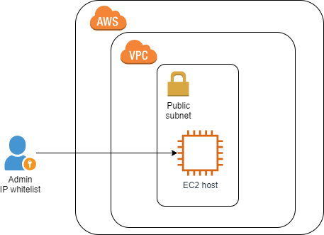
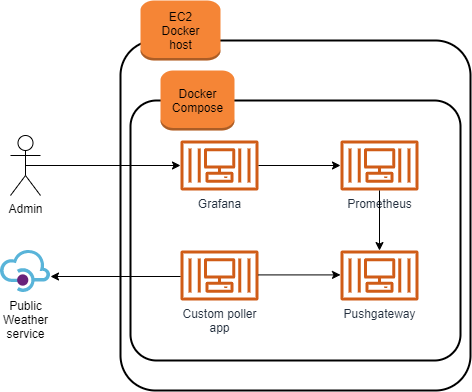

# About
This project is an implementation of a solution to spin up a new server, install and configure Prometheus with Grafana.

On the same server, a simple shell script is executed that uses public API to get current temperature in Tallinn and store it in Prometheus.

Simple dashboard in Grafana is provided to visualize temperature data.

The services are deployed using Docker-compose.

## Technology stack

This implementation uses the following tech:

- AWS EC2 for running a server
- Ubuntu 20.04.x for the server
- Docker 19.03.x, Docker-compose 1.25.x
- Prometheus 2.18.x, Grafana 6.7.x
- Ansible 2.9.x
- Terraform 0.12.x for infrastructure setup

## Pre-requisites

This implementation should be run on Linux. The implementation is built and tested on CentOS 7.

The following need to be installed locally and present on PATH:

- [Terraform 0.12.x](https://www.terraform.io/downloads.html)

### AWS authentication

IAM credentials can be provided via the envrionment variables AWS_ACCESS_KEY_ID and AWS_SECRET_ACCESS_KEY, representing AWS Access Key and AWS Secret Key, respectively.

```
$ export AWS_ACCESS_KEY_ID="Your Access Key"
$ export AWS_SECRET_ACCESS_KEY="Your Secret Key"
```

## Terraform

This implementation supports Terraform version 0.12. It utilizes modules to manage complex resources like VPC. This implementation does not use a remote backend for Terraform state and stores the state locally.

### Terraform variables

This implementation parameterizes required configurable settings through variables. Custom variables are defined in `variables.tf` and their values are controlled through `terraform.tfvars`.

## Architecture

### Network architecture


### Container architecture


## Connectivity

Connectivity such as SSH access to the host is restricted to a number of IP addresses using security group. SSH key pair for the host is created with Terraform and written to SSM Parameter Store.

# Installation instructions

Make sure you have pre-requisites and AWS authentication setup as mentioned above. 

### Clone repository

Clone the solution repository and go into its directory:

```
git clone git@github.com:0leksei/temperature-dashboard.git
cd temperature-dashboard
```

### Run installation

Tune variables values in `terraform.tfvars` as needed, and make sure to specify your IP address and whitelist it for host connectivity.

Execute `install.sh` to launch resources:

```
. install.sh
```

### Next steps

When `install.sh` has finished, it will echo a message with the URL of the created Grafana endpoint. Open this URL in a browser, login to Grafana as `admin\admin` and open a dashboard from `Dashboards > Manage > Tallinn Temperature`.

# Cleanup

To destroy all created resources, run `uninstall.sh`:

```
. uninstall.sh
```

# Links

The following public weather information service is used to get the temperature: 
http://www.ilmateenistus.ee/teenused/ilmainfo/?lang=en